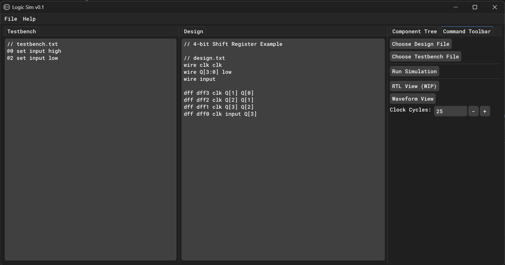
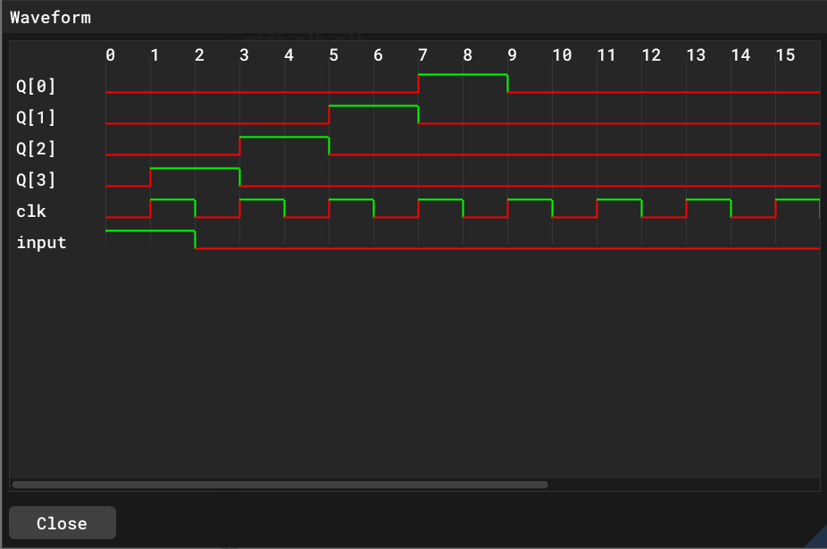

This project is still underdevelopment. Some features may not work or behave as intended. 

# FPGA-Inspired Logic Simulator

An FPGA-inspired logic simulator tool with waveform viewing, netlist parsing, and RTL visualization. Built in C++ using SDL3, OpenGL, Dear ImGui, and ImNodes.

## Features

- **Digital Logic Component Support**
  Includes support for AND, OR, NOT, NAND, NOR, XOR, and XNOR gates. Multiplexers, demultiplexers, flip-flops (D, T, JK, SR), as well as ROMs are also supported.

- **Waveform Viewer**
  Displays wire states over time using a ImGui-based timeline

- **Testbench Support**
  Load testbenches to define inputs over clock cycles

- **Netlist Parsing**
  Simple, intuitive netlist format for defining circuits and memory components (like ROMs)

- **RTL Graph Viewer (WIP)**  
  Uses `ImNodes` to render connected components

## UI Preview

- **Testbench Panel**: Define and set inputs based on clock cycle
- **Design Panel**: Design file for language

- **Waveform Panel**: Evaluate the circuit and displays wire states across cycles

- **RTL Viewer (WIP)**: Visual graph of components

## Dependencies

- [SDL3](https://github.com/libsdl-org/SDL)
- [OpenGL 3.3+](https://www.khronos.org/opengl/)
- [Dear ImGui Docking Branch](https://github.com/ocornut/imgui/tree/docking)
- [ImNodes](https://github.com/Nelarius/imnodes)
- [Native File Dialog](https://github.com/mlabbe/nativefiledialog)

## Building

### Prerequisites

- C++17 or newer

# Documentation

## Design
### How to implement components
Defining the component is case-insensitive. For example, `and`, `AND`, and `And` are all valid. The name for the component or wire is case-sensitive, so `myWire` and `mywire` are different identifiers and cannot be used interchangeably.

- Wires:
  - Wire:
    - `WIRE <name> <optional: high/low>`
`<name>` is the string identifier for the wire. You use this name to reference the wire when creating a component. The optional `high` or `low` sets the initial state of the wire. If not specified, the wire defaults to undefined.
  - Wire Bus:
    - `WIRE <name>[<start>:<end>] <optional: high/low>`
Wire Busses are used for groups of wires. `<start>` and `<end>` define the range of the bus. For example, `WIRE myBus[3:0]` creates a 4-wire bus named `myBus` with indices 0 to 3. The optional `high` or `low` sets the initial state of all wires in the bus. If not specified, the bus defaults to undefined.
To access a specific wire in the bus you reference it by `busName[index]`. Example: `AND and0 myBus[0] myBus[1] myBus[2]`
  - Clock Wire:
    - `WIRE <name> clk`
A clock wire is a type of wire that toggles between high low every cycle. 

- Component Types:
  - Logic Gates:
    - AND: `AND <name> <inputA> <inputB> <output>`
    - OR: `OR <name> <inputA> <inputB> <output>`
    - NOT: `NOT <name> <inputA> <output>`
    - NAND: `NAND <name> <inputA> <inputB> <output>`
    - NOR: `NOR <name> <inputA> <inputB> <output>`
    - XOR: `XOR <name> <inputA> <inputB> <output>`
    - XNOR: `XNOR <name> <inputA> <inputB> <output>`
Each gate has a name, inputs, and an output. `<name>` is a string identifier for the component. `<inputA>`, `<inputB>`, and `<output>` are wire names.
  - Multiplexers/Demultiplexers:
    - MUX: `MUX <number>x<number> <name> <inputWireBus1>...<inputWireBusN> <selectBus> <outputBus>`
    - DEMUX: `DEMUX <number>x<number> <name> <inputA> <selectBus> <output1> <output2>`
Multiplexers and demultiplexers take wire busses for inputs, outputs, and select. The `<number>x<number>` indicates the type of mux/demux, e.g., `4x1` would represent a 4-to-1 multiplexer. Each input bus size should match the size of the output bus. You must declare an input bus for each of the inputs required; for example:
```md
// Input, output, and select bus declarations
WIRE inputBus1[3:0]
WIRE inputBus2[3:0]
WIRE inputBus3[3:0]
WIRE inputBus4[3:0]
WIRE selectBus[1:0]
WIRE outputBus[3:0]
// The mux is a 4-to-1, therefore 4 inputs must be included.
MUX 4x1 mux0 inputBus1 inputBus2 inputBus3 inputBus4 selectBus outputBus
```

  - Flip-Flops:
    - D Flip-Flop: `DFF <name> <clock> <inputD> <outputQ> <default: rising/falling>`
    - T Flip-Flop: `TFF <name> <clock> <inputT> <outputQ> <default: rising/falling>`
    - JK Flip-Flop: `JKFF <name> <clock> <inputJ> <inputK> <outputQ> <default: rising/falling>`
    - SR Flip-Flop: `SRFF <name> <clock> <inputS> <inputR> <outputQ> <default: rising/falling>`
  
By default, flip-flops are triggered on the rising edge of the clock. You can specify `falling` to trigger on the falling edge instead. `<clock>` is the wire name for the clock signal. All input and output parameters are wire names. Example:

```md
wire clock clk
wire inputD d
wire outputQ q

// Rising edge D Flip-Flop
DFF dff0 clk d q
// Or DFF dff0 clk d q rising

// Falling edge D Flip-Flop
DFF dff0 clk d q falling
```
  - Read-Only Memory (ROM):
    - ROM: `ROM <name> <addressBus> <dataBus> <memoryFilePath>`
Address and data must be wire busses. `<memoryFilePath>` is the path to your rom file. This file should be a `.txt` file with each line representing a byte of data. Example:

```md
// rom.txt
0xF2
0x10
0x01
0xA8
```
```md
// design.txt
WIRE ADDR[3:0]
WIRE DATA[7:0]

ROM addr0 ADDR DATA rom.txt
```
Say, for example, you wanted to read the 4nd address (0xA8) from the ROM. And you wanted to use the testbench. (This is covered more in the testbench section below.)
```md
// testbench.txt
@0 set ADDR[0] low
@0 set ADDR[1] low
@0 set ADDR[2] high
@0 set ADDR[3] low
```
This will set the address to decimal 4 at clock cycle 0. The ROM will read the data at that address, which is 0xA8 (10101000 in binary), and assign it to the DATA bus. Notice, each address is 4 bits. Each data is 8 bits. Memory in the rom file must be defined in hexadecimal format.

## Testbench

### Assigning Inputs
The syntax for setting inputs in the testbench is as follows:
`@<clockCycle> set <wireName> <value>`

- `<clockCycle>` is the cycle at which the value should be set
- `<wireName>` is the name of the wire you want to change
- `<value>` can be `high`, `low`


Take a look at the following example:
```md
// testbench.txt
@0 set wireName low
@1 set wireName2 high
@2 set wireName high
```
This means at cycle 0, `wireName` will be set to low, at cycle 1, `wireName2` will be set to high, and at cycle 2, `wireName` will change again be set to high.

## Waveform View 
The waveform view shows the wire state at each clock cycle.
The amount of cycles to simulate can be defined in the sidebar panel. To populate the waveform view for the first time or after any changes you must click `Run Simulation` beforehand.